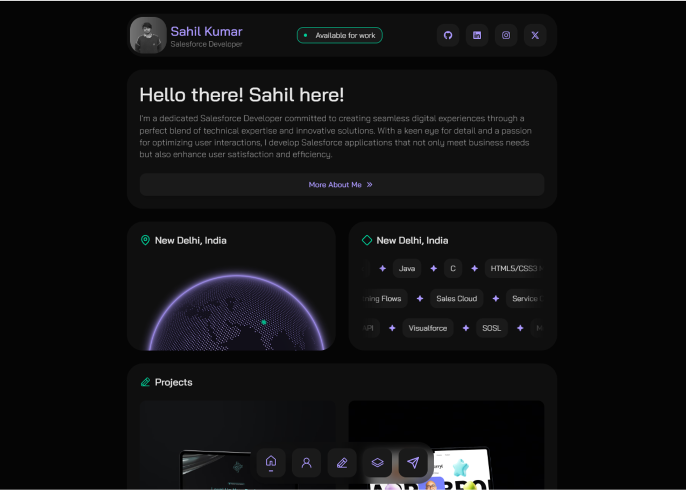
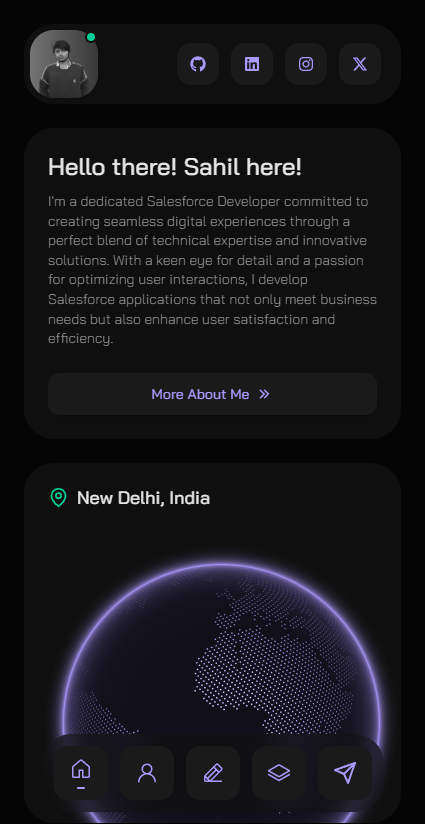

# DoMore (TODO) App

## Project Description
This is a React-based web application that showcases a portfolio of projects and technologies used. The app is divided into several pages, including Home, About, Projects, Stack, Contact, and Error.

## Table of Contents
- [Features](#features)
- [Structure](#structure)
- [Screenshot](#screenshot)
- [Links](#links)
- [Built With](#built-with)
- [Author](#author)

### Features
- **Dynamic Data :** Fetching content from Contentful to display projects, about me, stack details dynamically.
- **Responsive Design :** Utilizes Tailwind CSS for a fully responsive layout that adapts to different screen sizes.
- **Reusable Components :** Includes components like NavigationButton, StackCard, and more for easy reuse across the application.
- **Routing :** Implemented using React Router to navigate between pages smoothly.
- **State Management :** Manages global state with context API for data fetching and loading states.

### Structure
1. **Components :** 
    - **ProjectCard** : A component to display project cards with details such as title, description, tags, and image. It uses React Router for navigation.
    - **Footer** : A footer component that displays copyright information, a link to the GitHub profile of the creator, and mentions the use of React and Tailwind CSS.
    - **NavigationButton** : A reusable button component with an arrow icon that navigates to a specified path.
    - **StackCard** : A component to display stack cards, showing icons and names of different technologies.
    - **Stacks** : A section in the page that displays either featured or all stacks, using the StackCard component. It also includes a link to view all stacks.
    - **Contact, About, Projects, Stack, and Error pages** : These are individual pages of the application, each serving a different purpose as indicated by their names. They include components like Hero, Contacts, and SendMessage.
2. **Pages :** 
    - **App :** The main application entry point, located in src/App.jsx. This page uses React Router to navigate between different pages.
    - **Home :** The home page, located in src/pages/Home.jsx. This page displays a hero section and lists of featured projects and stacks.
    - **About :** Located in src/pages/About.jsx, this page provides more information about the developer.
    - **Projects :** Located in src/pages/Projects.jsx, this page lists all projects with details and links to individual project pages.
    - **Stack :** Located in src/pages/Stack.jsx, this page displays a list of stacks or technologies used in the projects, along with navigation links to individual stack pages.
    - **Contact :** Located in src/pages/Contact.jsx, this page provides contact information and a form for users to send messages.
    - **Error :** The error page, located in src/pages/Error.jsx. This page is displayed when an error occurs while navigating between pages.
3. **Utilities :** 
    - **icons :** A utility file that maps icon names to their respective React icons components, facilitating easy access and reuse of these icons throughout the application.
4. **Context :** 
    - The application uses a context (useGlobalContext) to manage global state or data (e.g., portfolio information) that is used across multiple components. This includes loading states, portfolio details, and possibly more.
5. **Main App Component (App.jsx) :**
    - The main application component manages the routing of pages using React Router. It includes a header, footer, and navbar components by default unless loading state is true (in which case it shows a loading message).
6. **Styling :**
    - Tailwind CSS is used for utility classes facilitating responsive design. Vite is configured to use PostCSS with Tailwind for preprocessing styles.
7. **Dependencies :**
    - The project includes several dependencies such as React, React Router, Contentful (for fetching portfolio data), and various UI libraries like react-icons for icons and styled components.
8. **Package JSON :**
    - Lists all dependencies required by the application and their versions.

### Screenshot
|          Desktop Design          |          Mobile Design          |
| :------------------------------: | :-----------------------------: |
|  |  |
|  |  |

### Links
- **Solution URL:** [GitHub Repository](https://github.com/Vi-r-us/do-more)
- **Live Site URL:** [Live Demo](https://virusnetic.netlify.app/)

### Built With
- React.js
- HTML5
- CSS3 
- JavaScript
- Tailwind CSS
- Contentful CMS
- React Icons

### Continued development

In the project directory, you can run:

### `npm run dev`

Runs the app in the development mode.\
Open [http://localhost:3000](http://localhost:3000) to view it in your browser.

The page will reload when you make changes.\
You may also see any lint errors in the console.

### `npm test`

Launches the test runner in the interactive watch mode.\
See the section about [running tests](https://facebook.github.io/create-react-app/docs/running-tests) for more information.

### `npm run build`

Builds the app for production to the `dist` folder.\
It correctly bundles React in production mode and optimizes the build for the best performance.

The build is minified and the filenames include the hashes.\
Your app is ready to be deployed!

See the section about [deployment](https://facebook.github.io/create-react-app/docs/deployment) for more information.

### `npm run eject`

**Note: this is a one-way operation. Once you `eject`, you can't go back!**

If you aren't satisfied with the build tool and configuration choices, you can `eject` at any time. This command will remove the single build dependency from your project.

Instead, it will copy all the configuration files and the transitive dependencies (webpack, Babel, ESLint, etc) right into your project so you have full control over them. All of the commands except `eject` will still work, but they will point to the copied scripts so you can tweak them. At this point you're on your own.

You don't have to ever use `eject`. The curated feature set is suitable for small and middle deployments, and you shouldn't feel obligated to use this feature. However we understand that this tool wouldn't be useful if you couldn't customize it when you are ready for it.

## Author

- Github - [vi-r-us](https://github.com/Vi-r-us)
- Frontend Mentor - [@Vi-r-us](https://www.frontendmentor.io/profile/Vi-r-us)

Feel free to explore the project in detail, and your feedback is always welcome! 🚀